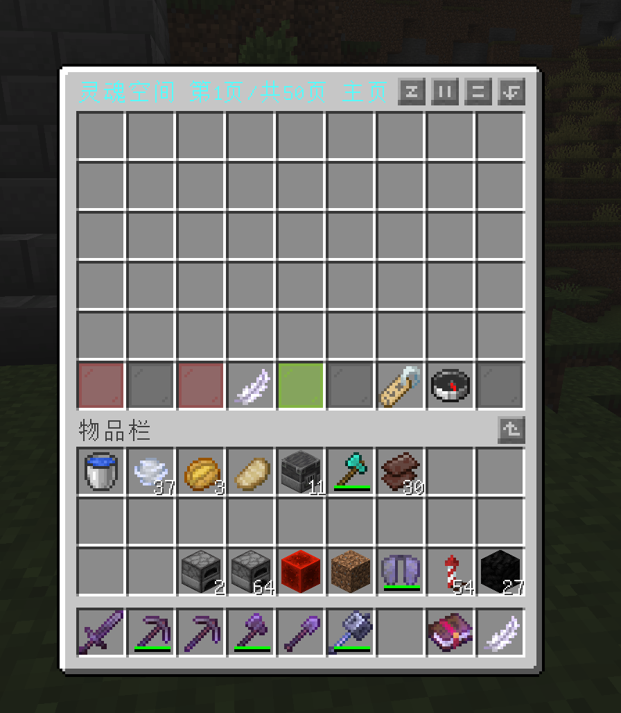

# SoulSpacePlugin - 一个MC服务器插件
依赖：Vault插件  
这个插件给了你一个非常大的背包，可以升级
## 使用方法：
输入/getbags（命令已修改为/ssp）可以花费初始金额~~开户~~来获取一个名字叫“[SSP] 灵魂空间”的羽毛，右键来打开.  
打开如下:
 
 
 
# SoulSpacePlugin - A Minecraft Server Plugin
depends: Vault  
This plugin gives you a very big backpack, which can be upgraded.
## How to Use:
Type "/getbags"(Command has been changed to /ssp) can spend the initial amount to get a feather named "[SSP] 灵魂空间", right-click to open.
